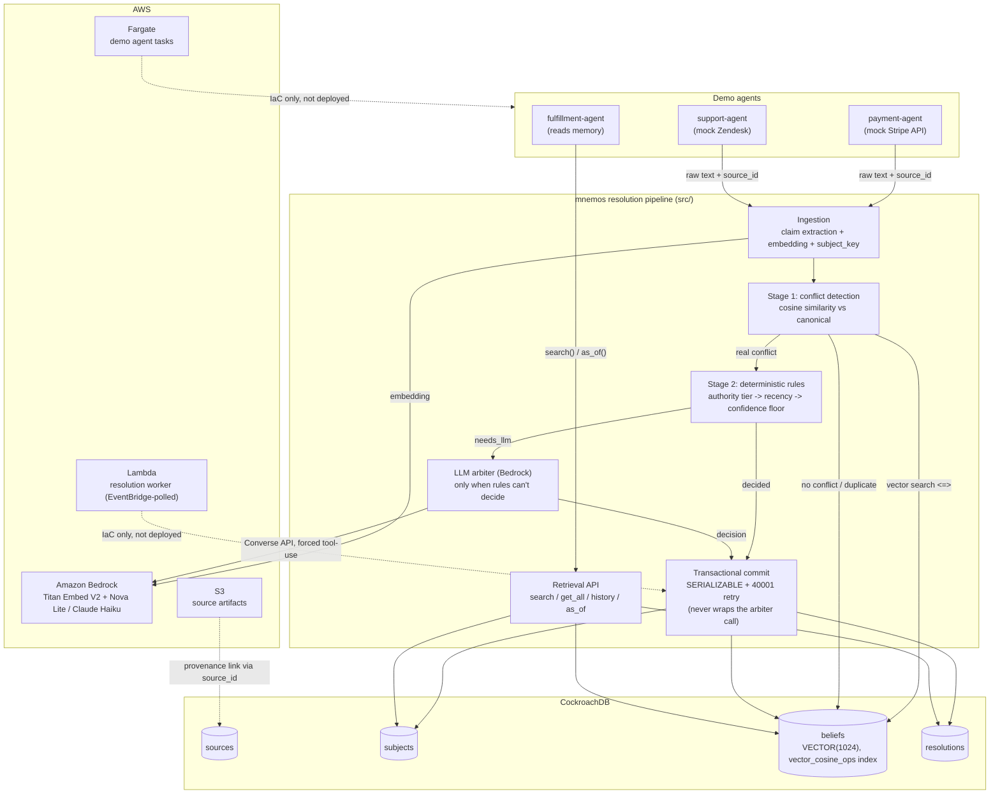

# Architecture

## Notes

- **CockroachDB is the source of truth**, not a cache: claims are attributed, never overwritten, and the only place canonical state actually lives.
- **The arbiter call always happens before the commit transaction opens** — verified explicitly in `docs/REVIEW_LOG.md` (Block 2B checkpoint), not just asserted here.
- **Lambda and Fargate are IaC-only** (`infra/`, validated via `cdk synth`), not currently deployed — see `docs/REVIEW_LOG.md` (Block 4A) for why and how to deploy them yourself.
- Full block-by-block build history and every checkpoint's real findings: `docs/REVIEW_LOG.md`.
