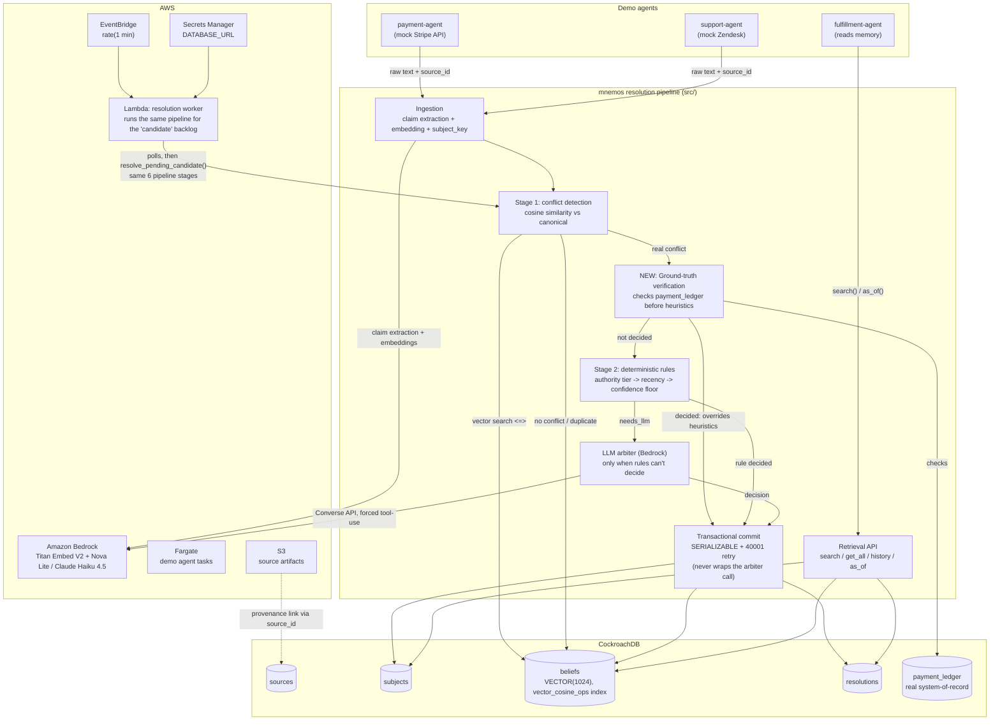

# Architecture

Raster version (for anywhere Mermaid isn't rendered, e.g. a submission form image upload): [`architecture.jpg`](architecture.jpg), generated by `scripts/generate_architecture_diagram.py`.

## Notes

- **CockroachDB is the source of truth**, not a cache: claims are attributed, never overwritten, and the only place canonical state actually lives.
- **Ground-truth verification runs *before* the heuristic rules**, not just to tiebreak them: for a verifiable-transaction subject with a real `payment_ledger` record, the actual verified state overrides what the authority-tier rule would otherwise decide. Falls through unchanged for every other subject or an inconclusive ledger match — see `src/resolution/verification.py` and the 2026-08-18 entry in `docs/REVIEW_LOG.md`.
- **The arbiter call always happens before the commit transaction opens** — verified explicitly in `docs/REVIEW_LOG.md` (Block 2B checkpoint), not just asserted here.
- **The AWS stack has been deployed and verified for real** (2026-08-18): `cdk deploy` → a real Lambda invocation against the live cluster (which found and fixed a real bug) → `cdk destroy` → `cdk deploy` again, identical result. It is not left running by default — see `infra/README.md`'s "Operational note" before redeploying near a live demo, since the Lambda polls and mutates the real database every minute while deployed.
- Full block-by-block build history and every checkpoint's real findings: `docs/REVIEW_LOG.md`.
