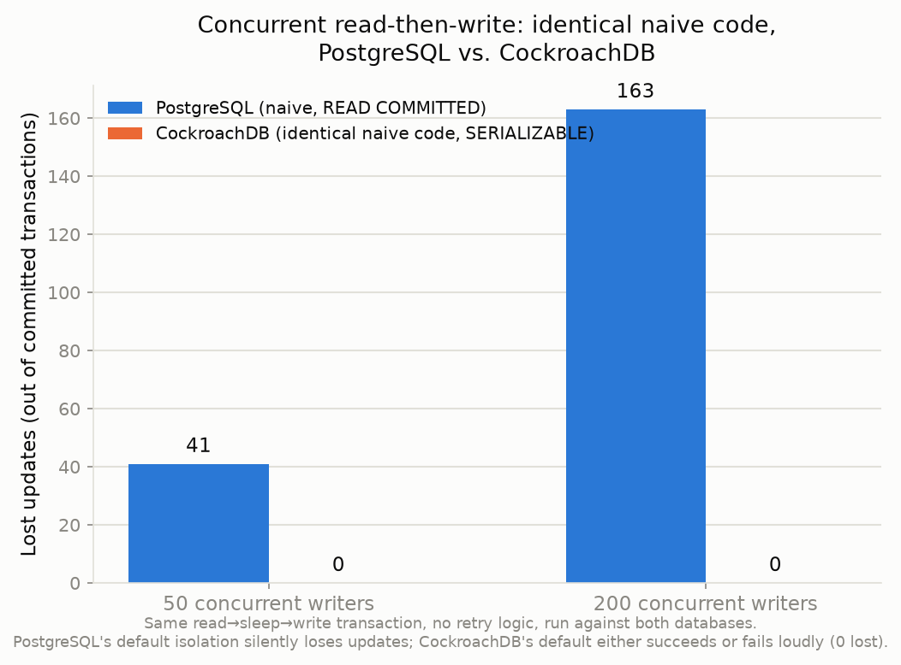

# Concurrency comparison: CockroachDB vs. naive PostgreSQL

## The experiment

The same Python code — `SELECT` the current value, sleep briefly (simulating real app-layer work), `UPDATE` to `value + 1`, wrapped in one transaction, **no retry logic** — run concurrently against two databases, at 50 and 200 simultaneous writers. Source: `scripts/naive_baseline.py`.

This is deliberately *not* "no transaction at all" — that's close to a strawman; every reasonably careful team wraps reads and writes in a transaction. The realistic bug is relying on a database's **default isolation level** without thinking about it. PostgreSQL defaults to `READ COMMITTED`, which does not protect a read-then-write against a concurrent read-then-write on the same row. CockroachDB's only isolation level is `SERIALIZABLE`, always.

## Results

| | 50 writers | 200 writers |
|---|---|---|
| **PostgreSQL** (naive, READ COMMITTED) | 50/50 committed with **no errors**, final value **9** → **41 lost** | 200/200 committed with **no errors**, final value **37** → **163 lost** |
| **CockroachDB** (identical naive code, SERIALIZABLE, no retry) | 2/50 committed, 48 errored, final value **2** → **0 lost** | 2/200 committed, 198 errored, final value **2** → **0 lost** |

The chart shows lost updates. The more important number is in the table: **PostgreSQL reported zero errors while silently losing up to 82% of writes.** CockroachDB, given the exact same unsafe code, never lost a single update — it just refused most of the writes outright, as loud `SQLSTATE 40001` exceptions the caller can't ignore.

## Why CockroachDB's numbers still look "bad" here — and what fixes it

Only 2 of 50 (and 2 of 200) writes succeeded on CockroachDB in this experiment, because this naive script has **no retry logic**. This isn't a weakness being hidden — it's the honest reason production code needs to handle `40001`. This project's actual commit path (`src/resolution/commit.py`) *does* handle it, and the difference is dramatic. Re-running the same 50/200-writer concurrency level through the real pipeline (`scripts/concurrency_test.py`, Block 2C's primary proof, logged separately in `docs/REVIEW_LOG.md`) — same database, same contention, but with the retry-with-backoff logic this project actually ships:

| | 50 writers | 200 writers |
|---|---|---|
| **CockroachDB + this project's retry logic** | all 50 accounted for, exactly 1 canonical, **0 lost** | all 200 accounted for, exactly 1 canonical, **0 lost** |

Every writer reaches a definitive, correct outcome — not just the 2 that happened to avoid a conflict.

## The honest takeaway

- PostgreSQL's default isolation level makes this specific bug **invisible**: the code runs, throws nothing, and quietly returns a wrong answer.
- CockroachDB's default isolation level makes the same bug **impossible to ignore**: it either works or throws, never silently corrupts.
- Neither database gives you correctness for free with zero effort — but CockroachDB's failure mode is the one you can build reliable retry logic around, and this project does.
